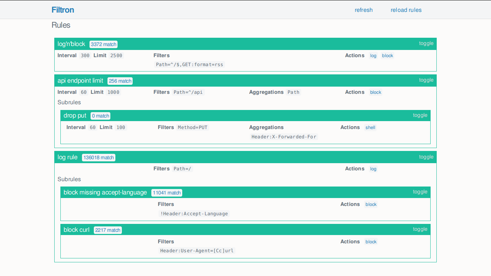

# Filtron

Reverse HTTP proxy to filter requests by different rules.
Can be used between production webserver and the application server to prevent abuse of the application backend.

The original purpose of this program was to defend [searx](https://asciimoo.github.com/searx/), but it can be used to guard any web application.


## Installation and setup

```
$ go get github.com/asciimoo/filtron
$ "$GOPATH/bin/filtron" --help
```


## Rules

A rule has two required attributes: `name` and `actions`

A rule can contain all of the following attributes:

 - `limit` integer - Defines how many matching requests allowed to access the application within `interval` seconds. (Can be omitted if `0`)
 - `interval` integer - Time range in seconds to reset rule numbers (Can be omitted if `limit` is `0`)
 - `filters` list of selectors
 - `aggregations` list of selectors (if `filters` specified it activates only in case of the filter matches)
 - `subrules` list of rules (if `filters` specified it activates only in case of the filter matches)
 - `disabled` bool - Disable a rule (default is `false`)
 - `stop` bool - Finish request validation immediately and skip remaining rules (default is `false`)


JSON representation of a rule:

```JSON
{
    "name": "example rule",
    "interval": 60,
    "limit": 10,
    "filters": ["GET:q", "Header:User-Agent=^curl"],
    "actions": [
        {"name": "log",
         "params": {"destination": "stderr"}},
        {"name": "block",
         "params": {"message": "Not allowed"}}
     ]
}
```
Explanation: Allow only 10 requests a minute where `q` represented as GET parameter and the user agent header starts with `curl`. Request is logged to STDERR and blocked with a custom error message if limit is exceeded. See more examples [here](https://github.com/asciimoo/filtron/blob/master/example_rules.json).


### `actions`

Rule's actions are sequentially activated if a request exceeds rule's limit

Note: Only the rule's first action will be executed that serves custom response

#### Currently implemented actions

##### `log`
Log the request

##### `block`
Serve HTTP 429 response instead of passing the request to the application

##### `shell `
Execute a shell command. `cmd` (string) and `args` (list of selectors) are required params (Example: `{"name": "shell", "params": {"cmd": "echo %v is the IP", "args": ["IP"]}}`)


### `filters`

If all the selectors found, it increments a counter. Rule blocks the request if counter reaches `limit`


### `aggregations`

Counts the values returned by selectors. Rule blocks the request if any value's number reaches `limit`

### `subrules`

Each rule can contain any number of subrules. Activates on parent rule's filter match.


## Selectors

Request's different parts can be extracted using selector expressions.

Selectors are strings that can match any attribute of a HTTP request with the following syntax:

```
[!]RequestAttribute[:SubAttribute][=Expression]
```

 - `!` can negate the selector
 - `RequestAttribute` (required) selects specific part of a request - possible values:
    - Single value
      - `IP`
      - `Host`
      - `Path`
      - `Method`
    - Multiple values
      - `GET`
      - `POST`
      - `Param` - it is an alias for both `GET` and `POST`
      - `Cookie`
      - `Header`
 - `SubAttribute` if `RequestAttribute` is not a single value, this can specify the inner attribute
 - `Expression` possible value:
    - a regular expression to filter the selected attribute values.
    - `nslookup(Hostname)` to filter the selected attribute values with the IP addresses of `Hostname`. Filtron resolves `Hostname` to its IP addresses when the rule is loaded (IPv4 and IPv6).


### Examples

`IP` returns the client's IP address

`GET:x` returns the `x` GET parameter if exists

`!Header:Accept-Language` returns true if there is no `Accept-Language` HTTP header

`Path=^/(x|y)$` matches if the path is `/x` or `/y`

`IP=nslookup(example.com)` matches if the client's IP address is one of the IP addresses of example.com.


## API

Filtron can be configured through its REST API which listens on `127.0.0.1:4005` by default.


### API endpoints


#### `/rules`

Loaded rules in JSON format


#### `/rules/reload`

Reload the rule file specified at startup


### WebUI

[UI](https://github.com/asciimoo/filtron/blob/master/ui) built on the API




## Bugs

Bugs or suggestions? Visit the [issue tracker](https://github.com/asciimoo/filtron/issues).
